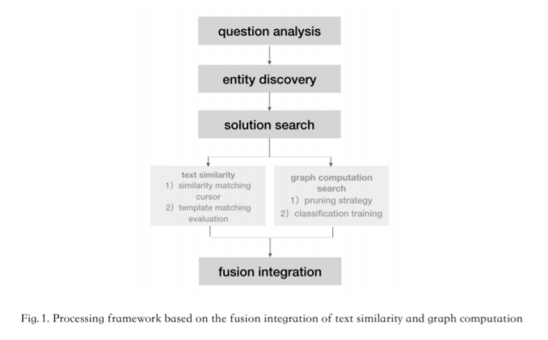
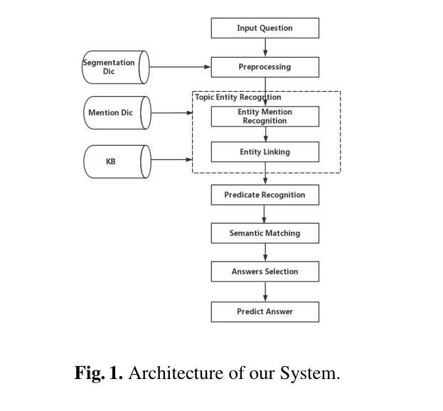
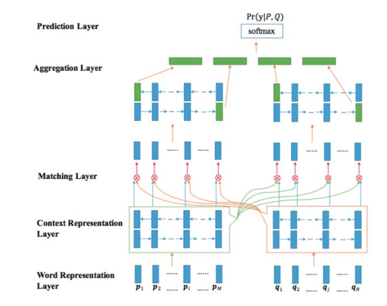

# CCKS 2018 论文笔记

## A QA search algorithm based on the fusion integration of text similarity and graph computation
### 结果

+ F1：NaN (1st)

### 系统

## A Joint Model of Entity Linking and Predicate Recognition for Knowledge Base Question Answering

### 结果

- F1：57.67% (2nd)

### 系统

### Entity Mention Recognition

+ Segmentation Dic是所有KB中实体以及在CCKS给的Mention Dic中的提及
+ 基于规则：
  + 实体提及长度
  + 实体提及的TF值
  + 实体距离疑问词的距离
  + 进行打分

### Entity Linking

+ 基于规则和语义，拿出实体两跳内的子图
  + 问题和三元组路径的词语覆盖率
  + 问题和三元组路径word embedding相似度
  + 问题和三元组路径的字符覆盖率

### Overall Entity Score

weighted linear score：$Score_{topicentity}=w_1*F_1+w_2*F_2+w_3*F_3+w_4*F_4+w_5*F_5+w_6*F_6$

### Predicate Recognition

+ extract 4 features of triple path:
  + 问题和谓词的词语覆盖率
  + 问题和谓词的word embedding相似度
  + 问题和谓词的字符覆盖率
  + 问题和谓词的char embedding相似度
+ rank top 10

### Semantic Matching

+ word embedding + 10 features above

+ 网络：BiMPM+Fea
  + Word Representation Layer: 将每个word映射到100维
  + Context Representation Layer：按照BiLSTM来encode每一跳
  + Matching Layer：BiLSTM+similarity
  + Aggregation Layer：aggregate question and triple path to fixed length
  + Feature Aggregation Layer：Aggregation Layer 拼接 10 features

### Answer Selection

+ 分为1hop和2hop，其中2hop区分答案在中心节点还是叶子节点